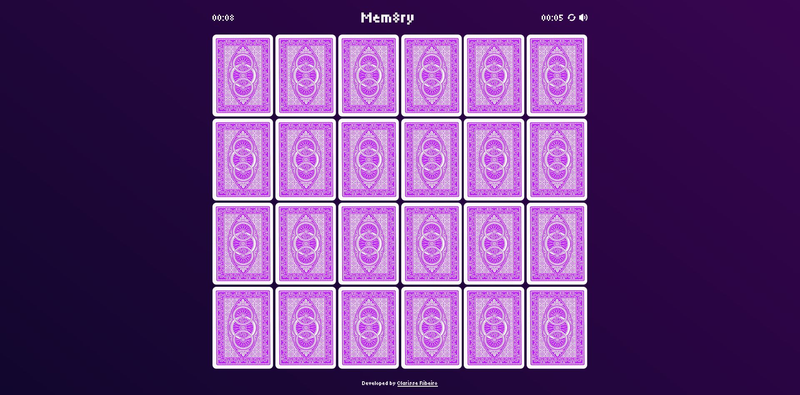
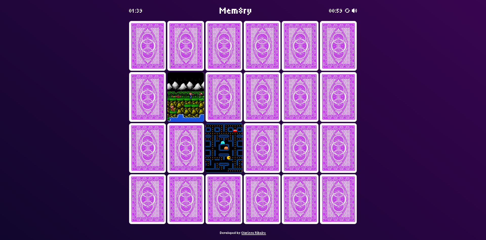

# Mem8ry | Memory Game | 8Bits, NES, Games

Um jogo simples de memória com temática do NES, pelo qual sou apaixonada. Foi desenvolvido do 0 por mim, com o objetivo de praticar JavaScript e pela diversão e desafio de criar um game completo. Conta com um design mais desenvolvido incluindo animações e sons. O objetivo é encontar todos os pares, e antes do seu próprio tempo record!

## Linguagens utilizadas:

-   HTML
-   SASS / CSS
-   JavaScript

## Informações adicionais:

-   O jogo é responsivo
-   O código é mobile first
-   Conta com timer, tempo record, botão de reset, botão de mute/play
-   Foi desenvolvido em inglês
-   Durante o desenvolvimento foram utilizados: Gulp, Sass, Autoprefixer, Prettier, Sourcemaps, Postcss, BrowserSync e Git

## Jogue agora:

https://clar5z.github.io/mem8ry/

## Prints:

